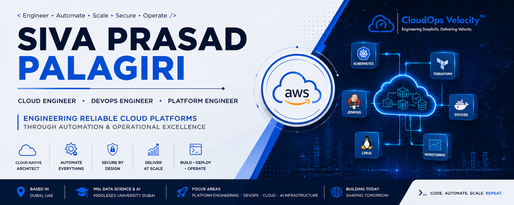

<h1 align="center">

Hi 👋 I'm <b>Siva Prasad Palagiri</b>

</h1>

<h3 align="center">

Cloud Engineer • DevOps Engineer • Platform Engineer

</h3>

Building reliable cloud platforms through automation, security, scalability, and operational excellence.

---

## 👨‍💻 About Me

I'm a **Cloud & DevOps Engineer** with hands-on experience designing, deploying, automating, securing, monitoring, and operating production workloads on **Amazon Web Services (AWS)**.

Over the past several years, I've worked across the complete infrastructure lifecycle—from cloud architecture and CI/CD automation to Linux administration, networking, production operations, monitoring, and technical documentation.

Alongside my professional work, I'm pursuing an **MSc in Data Science & Artificial Intelligence** at **Middlesex University Dubai**, where I'm expanding my expertise into **Platform Engineering**, **AI Infrastructure**, and **MLOps**.

I enjoy building cloud platforms that are secure, scalable, observable, and easy to operate through automation and engineering best practices.

---

# 🚀 Featured Projects

| Project | Description |
|---------|-------------|
| ⭐ **Enterprise Platform Engineering Case Study** | Production AWS Platform Engineering portfolio demonstrating architecture, CI/CD, networking, monitoring, security, Linux administration, and production operations. |
| 🌐 **CloudOps Velocity** | Founder project delivering Cloud Engineering, DevOps, Platform Engineering, and AI Infrastructure solutions. |
| ☸️ **Kubernetes Platform** *(Coming Soon)* | Production-ready Kubernetes platform with Helm, Ingress, monitoring, RBAC, and GitOps. |
| 🏗 **Terraform AWS Infrastructure** *(Coming Soon)* | Infrastructure as Code project provisioning production AWS environments using Terraform. |
| 🤖 **AI Infrastructure Platform** *(Coming Soon)* | Deploying AI models on Kubernetes with scalable inference infrastructure and observability. |

---

# 💼 Core Expertise

- ☁️ Cloud Architecture (AWS)
- ⚙️ Platform Engineering
- 🚀 DevOps & CI/CD Automation
- 🐳 Docker & Containerization
- ☸️ Kubernetes
- 🏗 Infrastructure as Code
- 🐧 Linux Administration
- 🌐 Networking & DNS
- 🔒 Infrastructure Security
- 📊 Monitoring & Observability
- 📚 Technical Documentation
- 🤖 AI Infrastructure
- 🧠 MLOps

---

# 🛠 Technology Stack

### ☁️ Cloud

---

### 🚀 DevOps

---

### ☸️ Platform Engineering

---

### 📊 Monitoring

---

# 📈 GitHub Statistics

---

# 🎯 Current Focus

I'm currently investing my time in mastering:

- ☸️ Kubernetes Platform Engineering
- 🏗 Terraform & Infrastructure as Code
- 🔄 GitOps with Argo CD
- 🤖 AI Infrastructure
- 🧠 MLOps
- 📊 OpenTelemetry
- ⚡ Platform Automation
- ☁️ Cloud Native Architecture

---

# 🎓 Education

🎓 **MSc Data Science & Artificial Intelligence**

Middlesex University Dubai

2026 – Present

---

🎓 **Bachelor of Computer Science**

India

---

# 🌍 Connect With Me

---

# 💡 Engineering Philosophy

> **"Great platforms are not measured by how quickly they are built, but by how reliably they operate, how securely they evolve, and how effectively they enable others to build."**

I believe Platform Engineering is about creating systems that simplify complexity, automate repetitive work, and empower teams to innovate with confidence.

---

### 🚀 Building Today. Engineering Tomorrow.

**Code • Automate • Scale • Repeat**

⭐ Thanks for visiting my profile!

